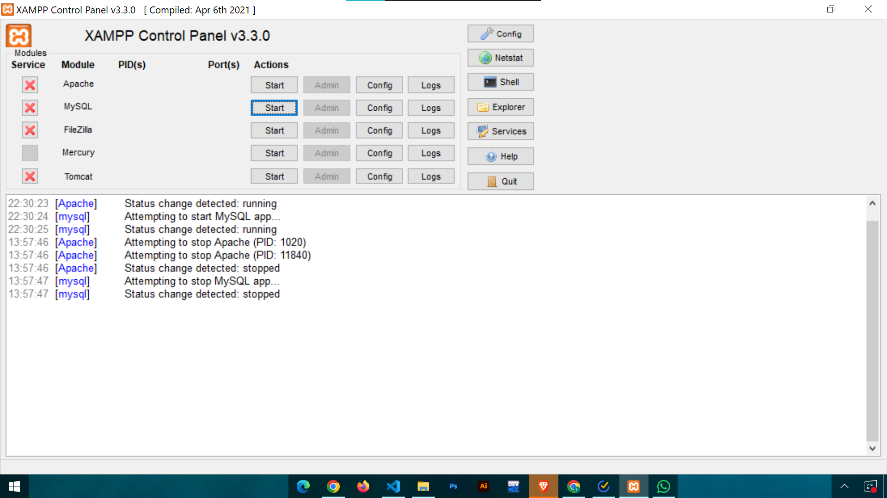

# school-formation-v2

## remark

- this file should be deleted before presenting the project

- this file is to read and understand how to setup a server with xamp and connect it with our project

## install xamp:

##### download link :

    - https://www.apachefriends.org/download.html

## project folder

- after installing xamp go and copy-past the project folder in 'C:\xampp\htdocs' or where over is your folder

## start server

- open xamp control panel
  
